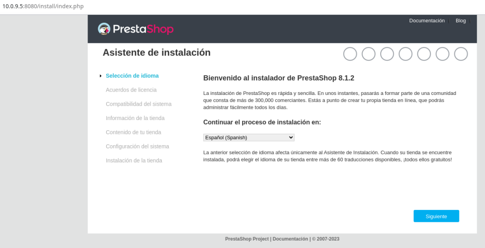
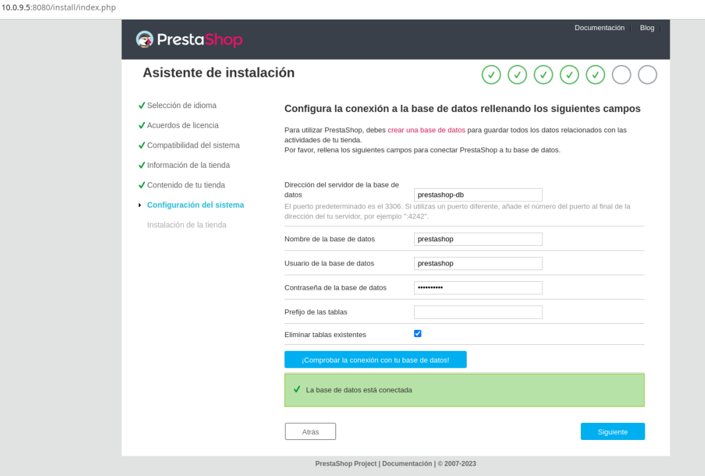

# Configuración de PrestaShop con Docker y Docker Compose

Este Readme nos guiara paso a paso en la configuración de PrestaShop utilizando Docker Compose. También lo vincularemos una base de datos.
Finalmente mostraremos nuestra tienda en Prestashop.


## Pasos
**1. Creamos el Proyecto**

Creamos en una carpeta con un Readme y un Docker Compose que creará el servicio tanto de Prestashop como de su base de datos.

**2. Configurar Docker Compose**

En el archivo **docker-compose.yml** anteriomente creado en la carpeta de tu proyecto, añade la siguiente informacion:

```yaml
services:
  prestashop:  # Define un servicio llamado "prestashop".
    image: prestashop/prestashop  # Utiliza la imagen oficial de PrestaShop.
    ports:
      - 8080:80  # Asocia el puerto 8080 de tu máquina con el puerto 80 del contenedor PrestaShop.
    environment:
      - DB_SERVER=prestashop-db  # Configura la dirección de la base de datos.
      - DB_NAME=prestashop  # Define el nombre de la base de datos.
      - DB_USER=prestashop  # Especifica el usuario de la base de datos.
      - DB_PASSWD=prestashop  # Establece la contraseña de la base de datos.
    volumes:
      - ./prestashop:/var/www/html  # Monta una carpeta local en el contenedor PrestaShop para gestionar archivos.
    depends_on:
      - prestashop-db  # Asegura que el servicio "prestashop-db" se inicie antes del servicio "prestashop".

  prestashop-db:  # Define un servicio para la base de datos.
    image: mysql:5.7  # Utiliza la imagen oficial de MySQL versión 5.7.
    environment:
      - MYSQL_ROOT_PASSWORD=someprestashop  # Establece la contraseña de administrador de la base de datos.
      - MYSQL_DATABASE=prestashop  # Crea una base de datos llamada "prestashop".
      - MYSQL_USER=prestashop  # Define un usuario de la base de datos.
      - MYSQL_PASSWORD=prestashop  # Establece la contraseña del usuario de la base de datos.
    volumes:
      - ./mysql:/var/lib/mysql  # Monta una carpeta local en el contenedor de MySQL para persistencia de datos.

```
Añadi comoentario en cada lonea que creo que nos explican de forma completa la utilidad que tienen.

**3. Iniciar los contenedores**

En nuestro terminal, ejecutaremos el siguiente comando para iniciar los contenedores tanto de PrestaShop y la base de datos:

```
docker-compose up -d
```
La primera vez tardara más de lo normal ya que tendrá que descagar las imagenes de ambos servicios, tanto Prestashop como sql.

Esto pondrá en marcha nuestro PrestaShop que por supuesto estará disponible en http://localhost:8080.

**4. Acceder a la tienda PrestaShop**

Abre tu navegador web y accede a http://localhost:8080 para configurar y utilizar tu tienda PrestaShop.
- Primera parte de la instalación.


- Última parte de la misma.


Para para los contenedores deberiamos de utilizar:

```
docker-compose down
```


## Conclusión

Ahora ya podemos distrutar de nuestro entorno PrestaShop instalado en Docker con su base de datos sql
¡Solo falta configurarlo a tu gusto!